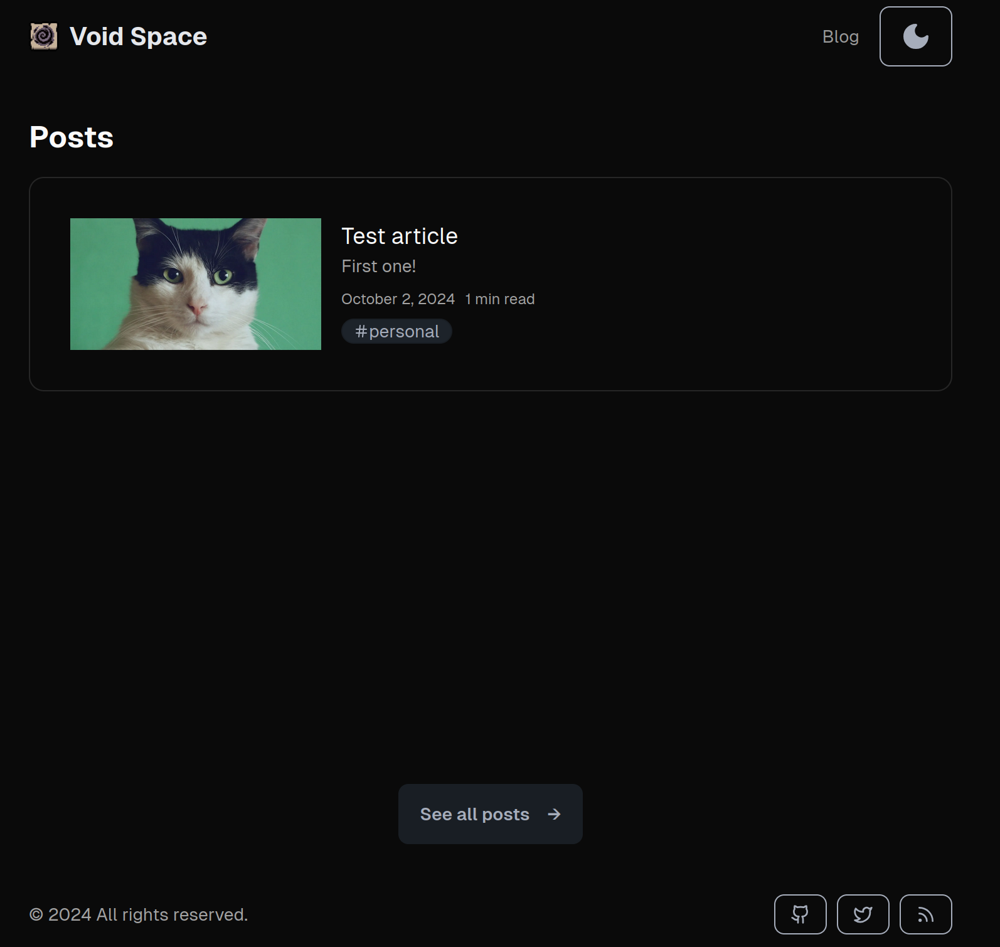
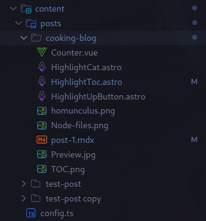
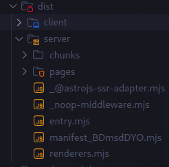
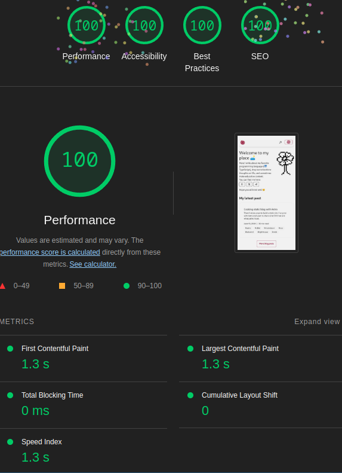
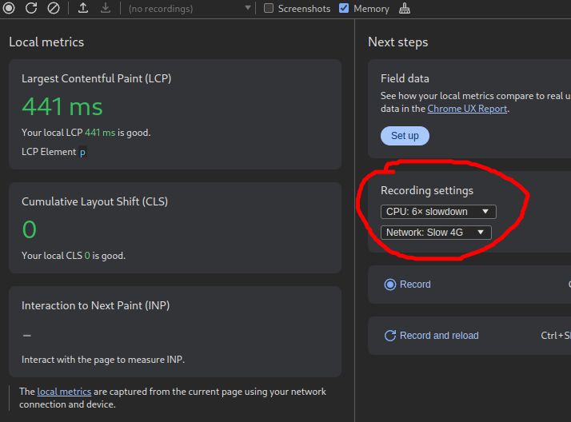

import MdxImage from '@/components/mdx/MdxImage.astro';

import Counter from './Counter.vue';
import HighlightCat from "./HighlightCat.astro";


## Introduction to the kitchen

It's been a long time since I build any personal project and I've decided to build a personal site ~~so the internet would notice me~~ to share some of my findings to help myself and others learn interesting stuff. As [Richard Feynmann](https://en.wikipedia.org/wiki/Richard_Feynman) said:

> If you cannot explain something in simple terms, you don't understand it

*P.S. Please don't look at it as a much of educative article, more like personal opinion/experience.
If you want to learn Astro, open the docs and follow the tutorial!*

I've heard about Astro a lot before and even used it in one of my work projects, but I have never dived deep enough to figure out why people even need static sites and why not just build everything in React.

There are frameworks which provide Static Site Generation (SSG) and Server Side Rendering (SSR) like `Next.js`, `Nuxt`, `Remix`, `SvelteKit` and the good-ol `Gatsby`, but I feel Astro is a frontier in pushing SSG to more like a web standard. Apart from the fact that it provides
very comforting Developer Experience with native `Markdown` and `MDX` parsing and many integrations with `CMS` tools, it also builds upon the new approach to web-development: `Islands Architecture`

### A history lesson

From the ancient times of PHP and very early releases of Netscape, people were thinking about interactivity. It made websites alive! And JavaScript provided that, even while being a tricky language. But as everybody probably think and know now as it is a hot topic, JavaScript could actually slow down the website. It is especially aparent on mobile devices as parsing and executing even gzipped code is consuming battery charge and taking the small network speed they have. And as many would cite, if the page is slow, your business will feel that in suffering of losing its audience as it feels that website is cheap and maybe even a scam.

Plus to that, when using just Client-Side rendering like Vue or React provides you with, 
your website may not be as SEO-friendly and crawlable by Googlebot (although it betters over time). On the other hand, when loading a webpage, your users may see a sudden flash, maybe even prolonged one while any scripts load at all, which could ruin every experience.

Here I want you to understand a difference between two terms: `Website` and `Web applications`. 

Client-side frameworks have received their growth because it became trendy and actually very   efficient to build `Web applications` that are no less than real computer apps that you download an installer for, while being much more easy to work with. Even so, there are apps that ship to desktop while running Frontend WebView under the hood, like Electron and Tauri. They are in the demand, and VSCode, Discord, Spotify, even FeedTheBeast Minecraft launcher are running Electron because it is easy to build after having experience with using these tools on frontend. Those have a very high degree of interactivity.

This is a Web Applications ([By freepik](https://www.freepik.com/free-vector/dashboard-user-panel-template_6144806.htm#fromView=search&page=1&position=1&uuid=d5fb43c7-d255-44ab-b398-10ed05df0c04)):

import webapp from './Webapp.jpg';

<MdxImage src={webapp}  alt="Web app" />  

And on the other side of the coin is `Websites`. Those are news magazines, personal portfolio pages, blog sites, even e-commerce, documentation pages and so on. There are no complex logic behind them. They may include few widgets like a small calendar or rss feed button, but ultimately they may use Wordpress or some other CMS, or even build with native JavaScript, as most of the content is really just HTML & CSS. Those may have at best a custom mobile burger and some carousel with one Call to Action modal or a form.

import website from './Website.jpg';

This is a Website ([By freepik](https://www.freepik.com/free-vector/liquid-effect-landing-page_4335546.htm#fromView=search&page=1&position=4&uuid=df62a421-566a-4411-a2a3-96f7f2f74b78)):
<MdxImage src={website}  alt="Website" />  

`Websites` may not even require build step. There is not much dynamic info on them, so they could be easily cached.

`Web applications` may update data each millisecond so you would keep track of your ad revenue. They may show you tens of dozens complex charts that you could look at, while running in your browser.

### Why Astro?

And so, to use React, Vue and other rendering libraries for the purpose of building websites, people have introduced `Meta frameworks` like `Next.js` for React and `Nuxt` for Vue. Those meta frameworks are responsible for making experience with the technology applicable to build a landing page for your web app with providing developer to `Server-Side render` their app, and then `hydrate` every interactive part to the client. That means, instead of sending empty `HTML` pages with modules to bootstrap the application at user's device expense, there would be a `server-entry.js` file generated with `express` or `Nitro` under the hood to serve requests from `Node` or other runtime.

It makes app faster to serve: your database and file system is much closer to the server, which reduces latency rather than fetching it from outside. Plus, server-side environment provides an ability to have secrets in it without them being easily leaked like it happens on the client. So, the app becomes more coupled and `universal`.

Having mastered Vue, you could use that to build a e-commerce store that would mostly look like a bunch of HTML & CSS sprinkled with JavaScript, but with the speed of building with components, reactivity features and ecosystem, even when Vue is not much concerned with what all that is.

With Meta frameworks, all problems related with Time-To-Interactive metric, Seo, and flashes would seemingly be gone. But even though SSR can be cached and managed properly, having to adapt this mental model could be quite complex. Trying to dissect where components run and should run is a mental excersise. You can feel it most crucially in "the new Next.js" with `React Server Components` adaptation.

> Where do I put my code, on the server, or on the client?

> Where do I get the data from db?

> Is it safe here?

And it is easy to make mistakes, just how it may be easy to ruin your memory handling in C or run into undefined behaviour, while mistake could go unnoticed until it ruins someone else's (or even yours) experience.

Astro is different. There is a clear separation between what runs where. It is achieved through
that paradigm:

> Everything is either prerendered or ran on the server, and you may add JavaScript precisely where you want it.

So, everything is at your control. You may not give into a behaviour you don't want, and Astro ensures this.

An example of this would be this tree of components:

```astro title=index.astro
<ComponentA>
  <ComponentB>
    <ComponentC>
      <ComponentD client:load />
    </ComponentC> 
  </ComponentB>
</ComponentA>
```

Here, ComponentD is hydrated to the client, means that the client-side logic inside would be working, but everything else is not. So, ComponentC would not have a clickable button or a working JS slider, and no JavaScript, secret API keys would be leaked to the other side.

Also, all Astro components are purely static and run on the server, so you have a capacity to import a database client, running your environment (like Node or Cloudflare Workers) API, using operating system and so on.

So, unless you specify explicitly to send component to the client, it would not be interactive. In SSR, that is reversed, which may not be a good way to handle building `Websites`. And here's where Astro shines.


**Grab that!**

<Counter client:visible />

Sorry for that bunch of Preact bundle I got into your browser right now 👀 However, you didn't actually download it before you have seen it, because I added it like so, with a directive: `<Counter client:visible />`. It works with `IntersectionObserver` that tracks the element's visibility on the screen, and if it is visible, it will `hydrate it to the client`.

That makes Astro a meta-framework for every UI-library there is: `Solid`, `Svelte`, `Preact` are no exceptions. It is simple and efficient, easily landing you all 100's on Lighthouse score.

Astro prevents mistakes of leaking JavaScript, helps with in-built optimizations,
provides an ecosystem of plugins and integrations for every task you'd have at building and very thorough thourough documentation and warming community at Discord that helps.

So, here's my path!

## Mistook apples for oranges

I thought the fastest way to learn and actually use was to copy someone else's template and build upon it. [Astro Erudite](https://github.com/jktrn/astro-erudite) as I was searching through github as it had everything that I wanted and more. So, I frivoulously cloned it and right away decided to switch UI kit to `Daisy` as I see `shadcn-ui` as a more SaaS-y approach to styling. That was my horrible mistake and a great blessing, since I spent an immeasurable amount of time trying to decode someone else's code and decisions while swapping components one by one. At last, I ended with a half of enscribe's child and my own homunculus:



I wanted to learn more about Astro after finishing rebuilding this template, but at the end I just snapped and started my own project. I took a lot of inspiration and learning in parts which I didn't understood well from it, so thank you [the great Open-Sourcer](https://github.com/jktrn/astro-erudite)! 

So, here's my take on Astro. You can get all the source snippets from [the repo](https://github.com/Serpentarius13/personal-blog). Note that sometimes I'm citing partial snippets to show the main ideas, but the full code is always available there. Also, I use `Astro v4.15.11`, so check your version to avoid inconcistencies and misinformation about newest practices.

## Tasty menu

To build a static website, you will come at some issues right away and some will come later.
Here's my full list (aside from the Astro itself, that the documentation help you will for):

- How to style it? 🖌️
- Where to get icons? 🎎
- How to write in Markdown and stay interactive& 🖊️
- How to highlight code? 🌈
- How to add client-side logic? 🏭
- How to make it searchable? 🔍
- How to store persistent data? 💾
- How to deploy it? 🚀
- How to make it cool? 😎

That would be the contents of this article. Let's begin!

## Instagrammy bacon and eggs

As a styling solution I decided to stick with [`Tailwind`](https://tailwindcss.com/) as it is the fastest way to write `CSS`. Some of it may look ugly, and it did, but what's happened happened.

To get started, I had to enter just one command:

```bash
pnpm astro add tailwind
```
Here, Astro CLI installed integration for me and created `tailwind.config.ts` for me. You could use other name, for example `solid` to install solid integration. Or you may have added `@astrojs/tailwindcss` package yourself and put it into integrations:

```ts title=astro.config.ts
import tailwind from "@astrojs/tailwind";

// in config
integrations: [ tailwind() ],
```

For the UI-library, as I mentioned, I took [`daisyUI`](https://daisyui.com/) which got me tinker with it for a bit before actually getting the way to use it, but in the end it was much worth it as I didn't have to write many usable things from scratch and got an immensely good home-looking design for free, which would take ages to build from scratch.

import ThemeDropdown from "@/components/astro/ThemeDropdown.astro";

### Multiple dressings for choice

One of the most enjoyable things about Daisy is its inbuilt themes support. Take a look at the theme picker right here:

<ThemeDropdown class="!dropdown-top not-prose"> Click me!</ThemeDropdown>

And Daisy has even more themes, although I would hesitate to add them all because the bundle size would grow a little.

This dropdown is built with the use of cool interaction based on `MutationObserver`, which powers I lent for the first time. While my component renders a dropdown that changes a document `data-theme` property:

```astro title=Layout.astro
---

<div
  class="dropdown"
>
  <div
    tabindex="0"
    role="button"
  >
    Button
  </div>
  <ul>
    {
        // render all themes from config
      THEMES.map((theme) => {
        return (
            // add data-theme to showcase new colors in a button
          <li data-theme={theme}>
            <div
            // give ids to add event listeners later
              id={`theme-switcher-${theme}`}
            >
              {theme}
            </div>
          </li>
        );
      })
    }
  </ul>
</div>

<script>
  const handleSwitchTheme = (theme: string) => {
    document.documentElement.dataset.theme = theme;
  };

  // add event listeners to switch document theme
  document.querySelectorAll(`[id^="theme-switcher-"]`).forEach((el) => {
    el.addEventListener("click", (event) => {
      event.preventDefault();
      const theme = (event.target as HTMLElement)?.parentElement?.dataset
        .theme as string;
      handleSwitchTheme(theme);
    });
  });
</script>
```

Script loaded in the document watches the changes and reacts with localStorage syncing, while loading the theme from it at first too:
  
```ts
<script is:inline>
  const darkThemes = ["dark", "aqua"];
  const THEME_KEY = "theme";
  const getThemePreference = () => {
    // if saved return that
    if (typeof localStorage !== "undefined") {
        const theme = localStorage.getItem(THEME_KEY);

        if (theme) {
          return theme;
        }
    }

        // grab user's preferred color scheme if not
    return window.matchMedia("(prefers-color-scheme: dark)").matches
        ? // must be synced on its own without config because I don't wanna
        // import themes into head on page load
        "night"
        : "autumn";
  };

  const getDocumentTheme = () => {
    return document.documentElement.dataset.theme;
  };

  const setDarkMode = (document) => {
    const theme = getThemePreference();

    document.documentElement.dataset.theme = theme;
  };

  setDarkMode(document);

  if (typeof localStorage !== "undefined") {
    // creating observer instance.
    // when `data-theme` defined below changes, it syncs local storage
    const observer = new MutationObserver(() => {
        const theme = getDocumentTheme();
        if (!theme) return;
        localStorage.setItem(THEME_KEY, theme);
    });

    observer.observe(document.documentElement, {
        attributes: true,
        attributeFilter: ["data-theme"],
    });
  }
</script>
```

This is way too cool! 😎

One important thing about this approach is that I had to make script `inline` and put it in the `<head>`, so the website would not ~~FART~~ flicker when loading initially as it would load the script ahead before rendering the page. `Inline` means that Astro would not optimize my script and bundle it as a `module`, but leave it as-is. It removes the ability to use TypeScript and import utilities from other parts of the project, but the importance here is to provide small as possible way to load the theme without any flickers.

I've got into a rut with this issue because I didn't really know how page loading was done deep down, so I was putting the script below body, above body and finally at the end of the head to figure out what did not mess my page load and would not flicker. This highlights how important it is to get good with the basics.

### Writing attractive invitations

As for typography, Daisy recommends using `@tailwind/typography` package, which I went with. It is nice on itself, and very tweakable - for example when rendering markdown I wanted to remove this plugin's styles on `<code>` blocks, and here its done with just one line:

```html
<div class="prose prose-code:not-prose">
```

Another thing I want to mention is `cn` function:

```ts
import { clsx, type ClassValue } from "clsx";
import { twMerge } from "tailwind-merge";

export function cn(...inputs: ClassValue[]) {
  return twMerge(clsx(inputs));
}
```

I think you can add it literally in any project with Tailwind,
since it is a live-saver as it does two things:

- It merges all classes with the way resembling `CSS specifity` - last one apply.
- And it removes unnecessary classes when duplicates appear. For example, with `mr-2` and `ml-2` appearing, it would collapse them to just `mx-2`.
- It provides nice API to work with conditional classes instead of ugly `&&`'s:

```ts
<div className={cn("class-1 class-2", {
    "class-3 class-4": isSomeCondition,
})}>
```

Well, anyway, some may find it worse than `&&`'s, but to each their own 🐈

### Looking for stickers 

Every website probably needs icons, and almost every time I start a new project I look for a way to get them.
Some people make a map like that:

```ts title=icons.tsx
export const ICONS = {
  General: {
    Github,
    Twitter,
    Telegram,
    RSS,
  } // and so on
}
```

Some people use [`feathers`](https://feathericons.com/) and add icons directly to their css.

Some people use [`Lucide`](https://lucide.dev/) or [`Iconify`](https://iconify.design/) with inbuilt components for frameworks.
I have gone with it too, since Astro has an `astro-icon` integration.
However, it required me to specify what icons I wanted to have, otherwise it warned me
that it would load them all in the bundle. I did so, and was quite unhappy:

```ts title=config.ts
export enum IconSet {
  Catpuccin = "catpuccin",
  // other sets
}

export const ICONS = {
  [IconSet.Catpuccin]: {
    typescript: "typescript",
    // other icons
  },
} as const;
```

And in Astro config:

```ts title=astro.config.ts
import { ICONS } from "config";

import icon from 'astro-icon'

export const config = {
  integrations: [ icon({ icons: Object.values(ICONS) }) ], // map all used icons somehow
};
```

```astro 
<AppIcon set={IconSet.Catpuccin} name="typescript" /> <!-- type inferred -->
```

With that, I couldn't even use this component in my UI-libraries code too. So, it became a mess.

Then, I stumbled upon [`@iconify/tailwind package`](https://iconify.design/docs/usage/css/tailwind/#iconify-for-tailwind-css)
which makes `tailwind` work with iconify through classes. Here's how it looks:

```ts tailwind.config.ts blurredLines={2-3,7-8}
  plugins: [
    daisyui,
    typography,
    addIconSelectors({
      prefixes: ["line-md", "logos", "la", "game-icons"],
    }),
    scrollbar,
  ],
```

And in the code:

```html
<span class="iconify la--address-book"></span>
```

To render: <span class="iconify la--address-book"></span>

I made a small wrapper component in Preact (as I decided it would be my rendering tool)
for it, so I could tweak it later and find all my icons and also automatically add `iconify` class, it is needed to not add all needed icon styles to every icon class and reuse just one:

```tsx title=Icon.tsx 
import { cn } from "@/lib/cn";
import type { FC, HTMLAttributes } from "preact/compat";

interface Props extends HTMLAttributes<HTMLSpanElement> {
  className?: string;
}

export const Icon: FC<Props> = ({ className, ...rest }) => {
  return <span {...rest} className={cn("iconify", className)} />;
};
```

If i'd wanted, I would just use a class in my other UI component if I could not import this one there. Problem solved.

## Restaurant's layout

Markdown is a very friendly way of writing articles. You could of course use a CMS with some inbuilt HTML editor, or use HTML directly to style it later, but it just adds unnecessary. With Markdown, you could write text that looks great even when looking at it unparsed, you could load it to Github and share with others in Telegram or have Obsidian store it.

For the purpose of building interactive blocks like the counter above, I have choosen to use `@astrojs/mdx` integration. [MDX](https://mdxjs.com/) is a language that provides the ability to run JSX in Markdown files. But in Astro, that is not all: you could run any framework component without it necessarily being tied to React or Solid. MDX has also a feature of substituing components to render.

Markdown is a first-class citizen in Astro. There are ways to render it to the user: you could use `.md` or `.mdx` file extension in `pages/` folder like so:

```
project
└───pages
│   │   index.astro
│   │   some-page.md
```

Or as a bunch of files later fetchable with `import.meta.glob`:

```ts
const blogPosts = import.meta.glob("./blog/*.mdx"); // gets all files in blog directory ending with *.md

for (const post of blogPosts) {
  console.log(post);
}
```

But recommended approach is to use [`Content Collections`](https://docs.astro.build/en/guides/content-collections/). It is a framework-specific feature with reserved `content/` folder at `src`
directory of the project. Here's my `content/` while writing this article:



There is one important file: `config.ts` that looks like so:

```ts title=config.ts
import { defineCollection, z } from "astro:content";

const postsCollection = defineCollection({
  type: "content",
  schema: ({ image }) =>
    z
      .object({
        title: z
          .string()
          .max(60, "Title should be 60 characters or less for optimal Open Graph display."),
        description: z
          .string()
          .max(155, "Description should be 155 characters or less for optimal Open Graph display."),
        date: z.coerce.date(),
        image: image(), // here is an `image` zod object by Astro
        // we could check whether image has required dimensions for example like so:
        // image().refine(image => image.width === 1200 && image.height === 630, {
        //   message: 'The image must be exactly 1200px × 630px for Open Graph requirements.',
        // })
        imageAlt: z.string(),
        tags: z.array(z.string()).optional(),
        draft: z.boolean().optional(),

        trackIndex: z.number().optional(),
        trackName: z.string().optional(),
      })
      .superRefine((data, ctx) => {
        if ((data.trackIndex && !data.trackName) || (!data.trackIndex && data.trackName)) {
          return ctx.addIssue({
            path: ["trackIndex", "trackName"],
            code: z.ZodIssueCode.custom,
            message: "trackIndex and trackName must be used together",
          });
        }
      }),
});

export const collections = {
  posts: postsCollection,
};
```

`config.ts` uses `defineCollection` helper alongsize re-exported zod's `z` to build type-safe schemas for blog posts. Then, it is important to re-export `collections` constant for astro to notice it. When you start your project with `astro dev` or run `astro sync` directly, it would generate types for your collection to use in the project:

```ts
import { getCollection } from 'astro:content'

const posts = await getCollection('posts') // of type CollectionEntry<'posts'>
```

And here's my `frontmatter` - a metadata of the post:

```mdx
---
slug: "astro-blog-from-scratch"
title: "Cooking static blog with Astro"
description: "There's many ways to build a static site. I've gone with Astro and want to share what DX I had and what paths I took."
date: 2024-06-10
image: "./Preview.jpg"
imageAlt: "A Vitruvian man with head as Astro logo and Penis as Vanilla JS script holding Tailwind, Daisy, Solid and Shiki, with legs as Lighthouse & Robots.txt logo"
tags: ["astro", "shiki", "markdown", "seo", "tailwind", "lighthouse", "mdx"]
draft: true
---
```

I used a `slug` property myself, but Astro generates it automatically from file name. I wanted more consistency and control here, since later I would like to save some data in db for each post.

Then, we could render posts as a list of links:

```astro title=src/pages/index
---
import { getCollection } from 'astro:content'

const posts = await getCollection('posts')
---

<ul>
  Links to articles:
  {
    posts.map(post => <li><a href={`/blog/${post.slug}`}>{post.data.title}</a></li>)
  }
</ul>
```

And use `dynamic routes` to render each one:

```astro title=src/pages/blog/[...slug].astro
---
import type { GetStaticPaths, InferGetStaticPropsType } from "astro";
import { getCollection } from "astro:content";

export const getStaticPaths = (async () => {
  const posts = await getCollection('posts')

  // we statically generate an array of each param:props key-value pairs
  // that Astro will use to generate [slug].html files later
  return posts.map((post, ix) => {
    return {
      params: { slug: post.slug },
      props: { post },
    };
  });
}) satisfies GetStaticPaths;

interface Props extends InferGetStaticPropsType<typeof getStaticPaths> {}

const { post } = Astro.props; // type-inferred { post: CollectionEntry<"posts"> }
const { Content, headings, remarkPluginFrontmatter } = await post.render();
---

<Content />
```

From `render` method we receive `<Content>` component that we could directly use in Astro markup,
list of all headings flattened out and `remarkPluginFrontmatter` that carries data we passes to it (for example, from readingTime plugin). 

As this is all generated upfront, we could include complex logic to fetch data from `CMS`, run CPU-intensive tasks like sorting or optimizing, and this would not hurt our users experience.

### Combining the kitchen's efforts

As the browsers can't render Markdown natively, there should be a way to convert it to HTML.

Astro uses [`Unified`](https://unifiedjs.com/) for parsing markdown under the hood.

Unified is a toolset for processing Markdown, MDX, human-text and other types of content into `AST`'s (Abstract Syntax Trees) and vice-versa - transforming them back and forth between each other to give you the result you need. It gives developers a lot of flexibility to customize how the content goes from being an `.mdx` file to HTML being presented to the user.

There are two ~~remarkable~~ libraries in this ecosystem I needed: `remark` and `rehype`. `Remark` is a markdown processor, while `rehype` is an `AST`-to-`HTML` processor. For example, here's the `remark` plugin `recipe` from `Astro` docs, that adds
reading time to article's metadata:

```ts
import type { Root } from "mdast";
import { toString } from "mdast-util-to-string";
import getReadingTime from "reading-time";
import { filter } from "unist-util-filter";

export function remarkReadingTime() {
  return function (tree: Root, { data }: any) {
    // filter out code blocks from reading time
    const textOnPage = toString(filter(tree, (node) => node.type !== "code"));
    const readingTime = getReadingTime(textOnPage);
    // readingTime.text will give us minutes read as a friendly string,
    // i.e. "3 min read"
    data.astro.frontmatter.readingTime = readingTime.text;
  };
}
```

It removes code blocks from a tree, then converts a tree to text to calculate the reading time from it.

As for `rehype`, I haven't wrote a plugin myself as I didn't need too: [the ecosystem provides them at large](https://unifiedjs.com/explore/).
I used those four guys:
- `rehype-slug` for making heading's slugs to later target them in links via #heading
- `rehype-autolink-headings` to add links to headings, so users would be able to click on them and share with others
- `rehype-sectionize` to add `section` tags wrapping each heading to make it easier to target and style and for better SEO
- `rehype-external-links` to add `rel="nofollow"` and `target="_blank"` to external links and style them accordingly

Also, there's `rehype-pretty-code` for handling and styling code blocks which I tried to use, but it doesn't support multiple themes with `MDX` yet because of some unknown bug, so I had to put it down for something else: about this in the next section.

To parse MDX itself there's an integration `@astrojs/mdx` that works with all remark and rehype plugins. When used, it receives all options passed to `markdown` property in the config, so there's no need to copy them:

```ts title=astro.config.ts
 markdown: {
    syntaxHighlight: false,
    remarkPlugins: [remarkReadingTime],
    rehypePlugins: [
      [rehypeSlug, rehypeSlugOptions],
      rehypeSectionize,
      [rehypeExternalLinks, { target: "_blank" }],
      [rehypeAutolink, { behavior: "wrap" }],
    ],
  },

  integrations: [
    mdx(), // all plugins copied here automatically
  ],
```

### Exquisite solyanka

```rust title="main.rs"
const explanation: &'static str = r#"
    Solyanka (also spelled sel'yanka) is an old Russian national soup dish.
    The word "solyanka" has a figurative meaning in Russian as
    'mishmash', 'hodgepodge', 'disorder',
    'diverse mixture of the most diverse, hetergenous elements'
"#
```

As a programmer's education resource, I was of course obliged (unlike certain `linkedin` fella) to make working with code blocks
as smooth as possible. That meant syntax highlighting, line numbers, diffing, copy button and so on.

For highlighting code there exist two libraries that I know of: `Prism` and `Shiki`. First of all, Shiki is a cool name,
second of all, Prism seemed quite outdated and abandoned, and third of all, [this Anthony Fu's article](https://nuxt.com/blog/shiki-v1) convinced me that it was great.
Shiki, contrary to Prism, works not only at the client, but ahead of the time compiling at the server too,
and it is actually used in `VSCode` as a highlighter, so great support and high amount of themes to choose is imminent.

You could write a plugin yourself, but it would be a lot of work of course.
`rehype-pretty-code` plugin I mentioned above is a great one as it provides
almost all the features I needed out of the box, but the problem I mentioned was a big turn-off for me as I wanted to do multiple (2 YEAH!)
themes instead. At the time I was trying to make it work and stumbled upon [`expressive-code`](https://expressive-code.com/).

`expressive-code` is a library that is used under the hood in  [`Astro Starlight` documentation template](https://starlight.astro.build/).
Out of the box it was way cooler than `rehype-pretty-code` and there was no issues at all. I even wrote my own plugin to blur some lines like that:

```ts blurredLines={1-2}
import {
  secret,
  anotherSecret
} from "@expressive-code/core";1

secret(anotherSecret)
```

since it didn't have its own. Here:

```ts title=plugins/expressive-code-blur.ts
import { type ExpressiveCodePlugin } from "@expressive-code/core";
import { addClassName } from "@expressive-code/core/hast";

export interface PluginBlurSettings {
  blurredLines: Record<number, boolean> | undefined;
}

declare module "@expressive-code/core" {
  export interface ExpressiveCodeBlockProps extends PluginBlurSettings {}
}

export function pluginBlurLines(): ExpressiveCodePlugin {
  return {
    name: "Blur lines",
    baseStyles: `
      .blurred:before {
        content: "";
        position: absolute;
        top: 0;
        left: 0;
        width: 100%;
        height: 100%;
        background: rgba(255, 255, 255, 0.1);
        z-index: 1;
        backdrop-filter: blur(4px);
      }
      
      .blurred {
        position: relative;
      }     
    `,
    hooks: {
      preprocessMetadata: ({ codeBlock: { metaOptions, props } }) => {
        // Transfer meta options (if any) to props
        const range = metaOptions.getRange("blurredLines");

        if (range) {
          // Init hashmap to store all blurred line numbers
          const blurredLines: Record<number, boolean> = {};
          // Match all pairs with regex
          const matches = range.matchAll(/(\d+-\d+)|(\d+(?!-))/g);
          for (const m of matches) {
            const value = m[0];

            // Check if it is a range
            if (value.indexOf("-") > -1) {
              const [start, end] = value.split("-").map(Number);
              if (end <= start) throw new Error("Invalid range");
              for (let i = start; i <= end; i++) {
                blurredLines[i] = true;
              }
              continue;
            }
            // Else it is a single number
            blurredLines[Number(value)] = true;
          }

          const map: Record<number, boolean> = {};

          props.blurredLines = blurredLines;
        }
      },
      postprocessRenderedLine: ({ codeBlock, renderData, lineIndex, line }) => {
        if (codeBlock.props.blurredLines) {
          // use lineIndex to check if it should be blurred
          if (lineIndex + 1 in codeBlock.props.blurredLines) {
            // add blurred class to the line
            addClassName(renderData.lineAst, "blurred");
          }
        }
      },
    },
  };
}
```

And in config:

```ts title=astro.config.ts
import expressiveCode from "astro-expressive-code";
import { pluginBlurLines } from "./plugins/expressive-code-blur";

// in config
 expressiveCode({
      plugins: [... pluginBlurLines() ...],
 }),
```

[Full API example is referenced here](https://expressive-code.com/reference/plugin-api/)

`expressive-code` gave me highlights, line numbers, diffing, copy button and pretty wrappers for blocks instantly without any investment, which I liked and went along with it. The library may miss some extended features, but it is amendable with plugin API and explanations the docs provide.

One more thing about code blocks: They have `Jetbrains Mono` font, which I think makes code a bit more readable, provided by `fontsource` like so:

```astro title=/src/blog/[...slug].astro
---
import "@fontsource-variable/jetbrains-mono";
---
```

## DIY noodles

### Caloric-intake drama

import HighlightToc from "./HighlightToc.astro";

For making app interactive, I went with writing some vanilla JavaScript, because I wanted to freshen my knowledge and make things as primitive as they could be, and also the bundle size demon had me in his hand. 

As most frontend people are obsessed now with the problem of JavaScript bundle size, I thought it would be important to handle this most efficiently. I wanted to not include any more logic than I had to, and would decline any attempt of sane thoughts to persuade me into using a UI library. But you will see what catharsis few paragraphs ahead.

### Withdrawal symptoms

One the most complex interactions was <HighlightToc/> I could've probably built it much faster using any UI library, and all the roundtrips to dom with `querySelector`, `getAttribute` and others were a bit lost in my head.

It took me some time to research on the needed plugins to make headings and links to render
and also to tweak everything in a `<script>` tag. Some of that was from unnecessary complexity I made up as I tried to make several different implementations (as in highlight just one
or several headings, what styles to add and so on), and in the end I went the simplest route:

- Highlight every `section` (provided wrapper by `rehype-sectionize`) even remotely on the screen with `IntersectionObserver`
while account for headings margin like so:

```js
const header = document.querySelector("header");
const headerHeight = header ? header.offsetHeight : 0;

const observer = new IntersectionObserver(
  (sections) => {
    sections.forEach((section) => {
      const heading = section.target.querySelector("h2, h3, h4, h5, h6");
      if (!heading) return;

      const id = heading.getAttribute("id");
      const link = document.querySelector(`#toc li a[href="#${id}"]`);

      if (!link) return;

      link.classList[section.isIntersecting ? "add" : "remove"]("seeing");
    });
  },
  {
    rootMargin: `-${headerHeight}px 0px 0px 0px`,
  })

const sections = document.querySelectorAll(".prose section");
sections.forEach((section) => {
  observer.observe(section);
});
);
```

- Add intercepting smooth scroll to the links:

```js
const links = document.querySelectorAll(
    "#toc a[href^='#']",
) as NodeListOf<HTMLAnchorElement>;

for (const link of links) {
      link.addEventListener("click", (event) => {
      event.preventDefault();
      const target = document.querySelector(link.href);
      target?.scrollIntoView({ behavior: "smooth", block: "start" });
    });
}
```

- On mobile, do not add anything and render the block above the article. Maybe in the future I will add a button in the header to show it full-screen, but now it is just there.

As you can see now, this third block didn't get into production, and there's a button at the top of the screen. When writing this article, I've been looking at other people's blogs, and noticed that my design was very bloated, and I wanted to make it simpler. I made a button to close TOC so that it wouldn't bother user's screen when it is not needed.

From that I figured that if you don't know something, you will have a ton of ideas (or none, actually) how to build it, and may go into a deep rabbit hole of multiple decisions that do not work together. This especially hurts you if there's many unknown things, so you get lost even more easily.

So, here's what I've learned from that:

- See other people work and learn from it
- Plan, always!
- Dont break the plan just because you had a new idea 🙄 Think it thoroughly first

### Having sugarless cola

At the same time, I could've used `preact` while having access to all React API's just for 5-10kb final production bundle. This is achieved through `preact/compat` compatibility layer [described here](https://docs.astro.build/en/guides/integrations-guide/preact/#compat).

While React is about 100kb in prod, this tradeoff would've been minimal and less! `Svelte` could also be an option, because it compiles to pure native JavaScript with a client payload of less than 10 kilobytes even! Using those tools, I could've made all these script blocks much easier with inbuilt reactivity. So, using a framework is not always an overhead! Sometimes you don't want to `querySelector` all your stuff..

### Golden tickets made out of chocolate

Let's talk about something else..

For users to discover my content, I wanted to make two features: 

- A paginated blog to "encounter" content (which you could find at [here](/blog))
- A global search bar to "precisely look for" content <HighlightSearch> (which is here) </HighlightSearch>

It would be openable from anywhere and would give user ability to search for any content or keyword.

A global search might be done in backend, but when you have few articles that do not have much content, I don't think the investment in `Algolia` is worth it. 

While Astro provides [API for pagination out of the box](https://docs.astro.build/en/guides/routing/#pagination), the search is handled by separate libraries.
Coming from Astro docs, I found myself before two choices: [`pagefind`](https://pagefind.app/) and [`fuse.js`](https://www.fusejs.io/).

I have tried `Fuse.js` and it worked well, but `pagefind` seemed more feature-rich: it provided exact text excerpts, while with Fuse I was limited to just showing simple cards, and also filtering, sorting and so on. 

`pagefind` is a `Rust`-based static search artifacts generator. It makes resources to search at build-time and an API to call this search from the client. While blazingly-fast sounds cool, at first, I find it difficult because of the cumbersome way to load `WASM` bundle, artifacts and client-side API that is working through `window` binding. First, you need to generate it all, then put it in a public folder so you can import js client and so on..

Gladly, there was [this library](https://github.com/shishkin/astro-pagefind) and it was possible to integrate pagefind with Astro in few clicks. It provides a `Vite` plugin to incorporate already built pagefind index into dev runtime. And images don't work in dev, but its amendable.

I had some tinkering, mostly struggling with indexing & assets loading. For the lib to work, you need to build your project first, and then it would load pagefind script with Vite. 

For `pagefind` to index my pages correctly (I wanted it to index only blog posts), I added `data-pagefind-body` to my blog post container, so only blog post pages would be indexed:
```astro
<div data-pagefind-body>
  <h1 class="mx-auto mb-4 mt-4 w-fit text-6xl font-extrabold">
    {post.data.title}
  </h1>
  <!-- ... -->
```

And with that I had to hide code blocks from being indexed, because they show ugly in the search results and add line numbers to the index. I think it is enough to have search terms as a text.Here, `expressive-code`'s plugin API came to rescue again:

```ts
import { type ExpressiveCodePlugin } from "@expressive-code/core";
import { setProperty } from "@expressive-code/core/hast";

export interface PluginIgnoreIndex {}

declare module "@expressive-code/core" {
  export interface ExpressiveCodeBlockProps extends PluginIgnoreIndex {}
}

export function pluginIgnoreIndex(): ExpressiveCodePlugin {
  return {
    name: "Ignore index",

    hooks: {
      postprocessRenderedBlock: ({ renderData }) => {
        // I hid all code blocks, because article's text is sufficient to note about technology
        // plus to that, code blocks are not much readable in search results
        setProperty(renderData.blockAst, "data-pagefind-ignore", "all");
      },
    },
  };
}
```

To render `<Search>` component, I made two components: `<SearchTrigger>` and `<SearchDialog>`. The first one is a button that opens the search modal, which I put in the navbar, while the second one is a modal that is opened with `dialog` element.

Here, I made a mistake like the one with the `<head>` before. At first, I placed `dialog` in the body, but in the wrong place: right below my navbar. It was a critical mistake, as it slowed initial load time immensely, so I moved it lower, below `<Footer>`:

```astro
<body class="flex flex-col px-3 md:px-1">
  <Navbar>
    <slot name="navbar" slot="default" />
  </Navbar>

  <main class={cn("h-0 flex-1", mainClassname)}>
    <slot />
  </main>
  <Footer />

  <SearchDialog /> <!-- Here -->
</body>
```

Remember the part where I told you to wait few paragraphs for follow-up? Well, there it is. Apparently, `<Search>` component was importing CSS and JavaScript bundle of `@pagefind/default-ui` library statically. In dev mode it meant that in network tab a row with almost 1 megabyte of JavaScript would appear.

In production, it would be about 200kb, but the library loads `@pagefind/default-ui`'s css always, which added some kilobytes to CSS bundle. I had ripped my hair out since my perfectionism and child-playing got the best of me, and even wrote a `Vite` plugin to remove css and js from `@pagefind/default-ui` package when the app started and loaded it later with `import()` statements! But that made everything worse and was sure as hell not worth it 🚑 to save few kb.

The punchline is that when I was almost trying to publish the website and release the article, tweet and post to reddit like a newly famous internet celebrity, I noticed that my dialog with search was completely mangled on mobile and I couldn't even use it. So, I spent some three or four hours to remove an issue that wasn't there, while my app wasn't working! Ridiculous!

Of course, such excitement could spur productivity and enthusiasm towards something new, but its important to not overdo it. Do not remove your `axios` when starting a new project because you've heard of `ky` or `redaxios`, you could always replace it later. Do not start a project in a brandy-new Bun environment with fully-fledged alpha framework running its campaign on Tweeter. Think about what brings value to the user of your app, and after you've delivered that, sprinkle it with any confetti you want. At least, that's what I would tell myself every day from now on! 😹

import HighlightSearch from "./HighlightSearch.astro";

<HighlightSearch> Anyway, here's the result! </HighlightSearch>

## Storing wine and launching rockets

When I was looking for inspiration, I stumbled again upon [Josh Comeau's website](https://www.joshwcomeau.com/). It had this heart button with sound effects and my urge to steal was like never before. You may have seen the result of this, angry, or maybe happy now. <HighlightCat /> to see him! My personal orange! 🐈

This guy is needed for the purpose of bullying out like clicks from people, there is no mistake. But how to store anything over one client session in a static website? There were two ways.

One way was to convert my app to a `hybrid` one. That meant setting a config option like so:

```ts title=astro.config.ts 
output: "hybrid",
```

With that turned out, Astro would spit `Node` scripts with web-server instead of purely static `HTML` pages all on their own, which would grant me an opportunity to setup a database connector and not leave the boundaries of my project to make a separate backend. Here's the file structure for that:



I implemented all that, and it was working nice: API routes, Prisma, cool! But, I noticed a weird bug or maybe just a consequence of using Node builds: My app was loading all the Tailwind bundle of CSS without any treeshakes! I was wondering why my app would load 130kb of css, while Astro stated that Netflix's Tailwind website only weighs eight.

I've setup a new project and apparently with almost the same config the app was much smaller in size. And when I switched it from `static` to `hybrid`, the bundle size grew 5-fold: from 5kb to 25kb! 

Here, I thought it would be a fun experiment of trying out plan number two, which included a constraint of staying hosting-fee free.

### On rockets 

[`Vercel`](https://vercel.com/home) was my pick, because it is easy and free to publish any project of yours. Just host on Github, link it in dashboard and get free CI/CD, probably not the worst domain name according to your project name, SSL is handled for you and so on. Free plan is awesome!

And as I found out, Vercel could host your backend as `Serverless functions`. You may make a Node.js project from their template or you can just deploy a `Next.js` app with [`Route handlers`](https://nextjs.org/docs/app/building-your-application/routing/route-handlers). These are just HTTP verbs exported from `app/api` folder in the latest Next versions and you could write them like so:

```ts title=app/api/route.ts
export const dynamic = 'force-dynamic'
export async function GET(request: Request) {
  return new Response("hello world")
}
```

So, opening `/api` route in the app would return `hello world`.

It opens a possibility to host a free backend, but with a catch. Serverless means that there are some server resources being allocated and deallocated depending on the load automatically. Vercel would boot containers when request comes up and remove them after a time when there is no more requests coming up.

Serverless approach holds many benefits, but some disadvantages too. For one, to boot up new containers with long startup times, you would need to wait for a longer `cold start` times. And as I've heard, `Prisma`, my beloved ORM is not good at those as it ships with Rust binary. Prisma team have fixed some of it, I guess, but I wanted to use some other ORM instead.

For that I choose [`kysely`](https://kysely.dev/) which is a very lightweight and handy to use SQL query-builder. It doesn't manage migrations, so I have setup Prisma alongside it too just for the purpose of syncing schema and client types. Gladly, [`there is a generator`](https://github.com/valtyr/prisma-kysely) for making Kysely types out of Prisma schemas.

And for hosting database remotely I choose [`supabase`](https://supabase.com/) as it provides free hosting for `postgres`. I could've chosen other providers, even Vercel itself, but I didn't see any difference anyway, since all I want is just a free db for few records tops.

To glue it all together, I also had to switch default locations of supabase and both my hosts on Vercel to one region, so there would not be a lot of latency.

I wouldn't go into a complete implementation of all that, since its a pretty basic stuff. If you're interested, you can check out the code for the backend [in this repo](https://github.com/Serpentarius13/blog-server).


## Gordon Ramsay show

The last part's gonna be about cosmetic and useful things I screwed into the website as a icing on the cake.

I was intersted to dive deep into documentation for SEO. For a long time I thought it to be very abstract and far away from me, but as I'd seen my knowledge gap, I wanted to close it, just a bit. So, here's the new tools I've learned about:

- Performance and adaptivity matters most. At final steps of this project, I have even removed images from blog posts, because it smoothed loading times so much. Blogs should not be about much cosmetic, but rather about content. And as it is very easy to make text content fluid and very fast in HTML, it is also easy to stamp a lot of features to make it load 10 seconds and fail all Lighthouse audits. Look at [this fella](https://perfectsite.neocities.org/). It is sure perfect.

- Do some testing with Lighthouse. It has helped me to figure out where I messed up my accessibility. For example links, which is a very important part of SEO ranking your site higher. I haven't included labels for screenreaders on icon buttons, have used bad link names, didn't add `rel="nofollow"` on external ones, and so on. It also pointed some performance issues. And at the end it gave me some dopamine with all 100's scores 🆒



- I did not reap those accessibility rewards, and I don't know anyone personally who would use a screen reader, but at least consider another user who would use tab key for the sake of switching between buttons. Do not make links as `<button>`s. Do not make buttons as `<div>`s without `tabindex="0"`. And please, use `<dialog>` for modals, or at least think about what would happen, if user presses tab inside of them. Also, don't forget about contrast, it is quite important to read, y'know.

- Look at network tab and performance tabs. Slow down your requests to slow 4g or even 3g and check how your site behaves under these conditions. Does it load fast, what content pops up first? Have you added `loading="eager"` to your big image so that there would not be a huge Largest Contentful Paint? In `performance` tab you could even slow down processor speeds artificially to see how website would perform on lower-grade devices like mobiles.



- Make unique content. Some people claim AI can write for them - it's cool, but you should also write yourself, improve and cultivate style and taste. `If you can't think of something to write about something, then you should not be writing`. Do not write just for the sake of showing anything at all. At least tell how you feel. For example, after [this Daniel Roe's short story](https://roe.dev/blog/little-oak) I got pretty sad, but understood many things. So he healed me a bit, even though he didn't know me. That's probably because he healed himself with it at the time of writing, and that's what makes this post real.

- `Add RSS feed.` I like them. And they are everywhere.
Its not a mail newsletter in a sense that its not so advanced that you would track your reader's email and audience count,
but it is simple and `many people use them to get updates` about your blog.

- `Spend time delivering features and gathering feedback`. It is the most important step. You are making content for others, and as you're writing and (of course you do) putting yourself in shoes of your audience, you must give them something worthwhile instead of polishing the button for 10 hours that would break on the next commit anyway because you're human.
  
- Do not forget about important meta tags like `<title>` and `<description>`.
Research how favicons work (but you will be terrified!). Also, you could add [`OpenGraph`](https://ogp.me/) tags for making articles attractive for social networks. These are added with `og:[image]` meta tags, for example: `<meta property="og:title"> My great post! </meta>`. I also add these tags:

## Afterparty

In the end, I want to say that making this blog and writing this article was quite unveiling to me in many senses. I had seen once again in much bigger light that my obssessions about performance and idealism take the best of me.
All the preliminary optimizations were for trying to conceal my imperfections and inability to make every feature and make it perfect as I am limited.

After that, I have acknowledged that building something and investing yourself in life as a participant makes you better human being just because you have to see who you really are, which you maybe won't because you don't want to and there's nothing to push you to it. Setting goals, keeping promises given to yourself, doing real work, following the idea that your mind originated to its end - that's what I've been lacking greatly as a developer. 

I have tried making some apps, but infinitely, I have become a slouch who was making forms over and over and over again without taking greater challenges or abandoning my dreams when they became a little bit harder than I expected them to. Of course, there were challenges, and I have grown from them too, but while I didn't see who am I turning into - folder mover (architect), button painter (ui designer), frameworkista (qualified specialist), I actually became worse. When simplicity was required, I was trying to over-complicate, because I thought that's what smart developers do. Like that picture:


But smart developers actually make everything simple. You do not become a senior out of making another cool `Singleton Factory Static Abstract Facade Dependency Injected Service AWS Serverless Kafka provider`. Seniors want it to be just a little pack of if's and while's, because they already understood that you could write infinite amount of code, but only so much of it matters.

Astro is a great framework and a good learning resource for those who may find themselves in web development space. If you open the docs open-minded and build something yourself, try to see what tools you use, what code you write and how it actually works under the hood, what assets load and not, why is it better to have it this way. You will feel much better. Don't hurry - and it will pay out in the end 🐱

Thanks for reading!
